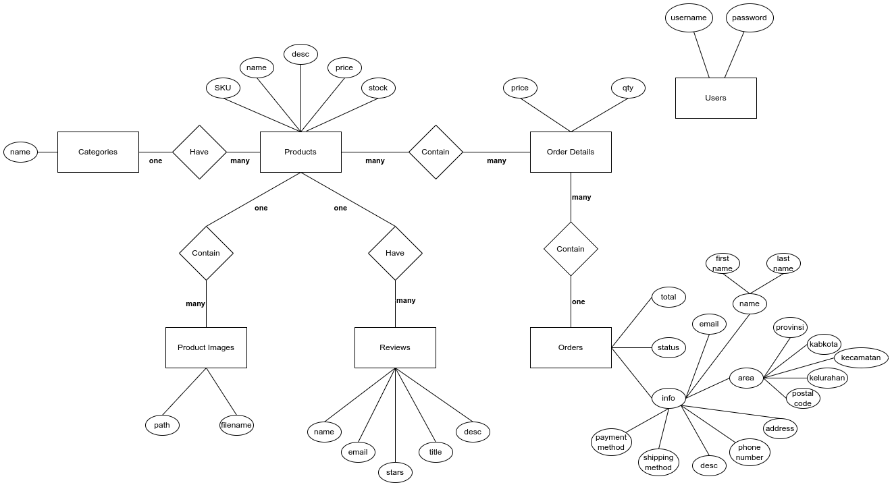
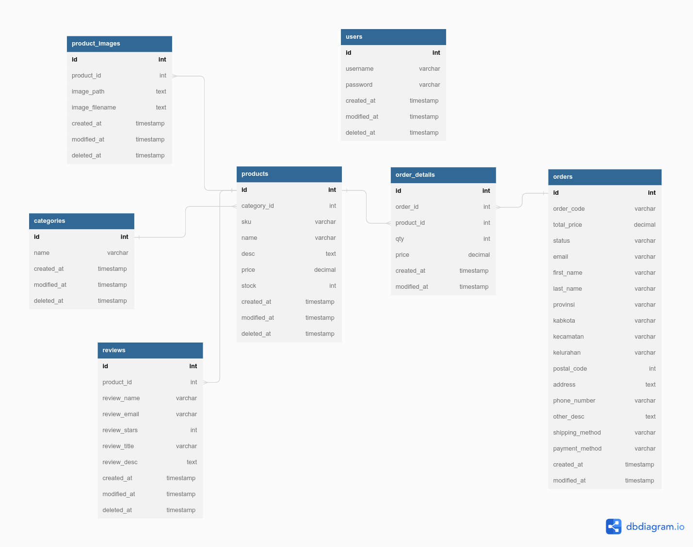
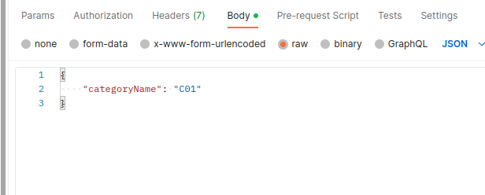
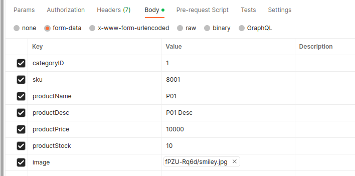
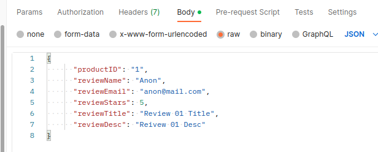
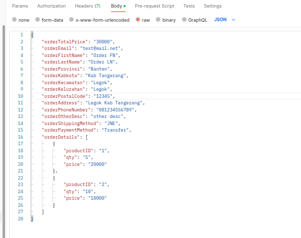
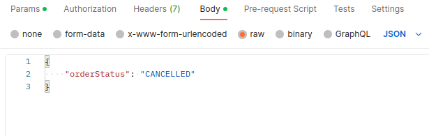

# Final Project harisenin.com Full Stack Developer Batch 4 - Backend

## Tech Stack

1. JavaScript Framework: NodeJS - ExpressJS
2. ORM Framework: Sequelize
3. Database: MySQL
4. Cloud Image Repository: Cloudinary
5. JavaScript Server: AWS
6. MySQL Server: FreeSQLDatabase
7. Package:

   - bcryptjs
   - cloudinary
   - cors
   - dotenv
   - express
   - jsonwebtoken
   - multer
   - multer-storage-cloudinary
   - mysql2
   - sequelize

## Batasan Fitur

1. CRUD Categories
2. CRUD Products
3. CRUD Reviews
4. CRU Orders
5. CR Users

## ERD





## Endpoint

| Endpoint          | Method | Auth? | Purpose                                 |
| ----------------- | ------ | ----- | --------------------------------------- |
| /categories       | POST   | Yes   | Insert New Category                     |
| /categories       | GET    | Yes   | Get All Categories                      |
| /categories/:id   | GET    | Yes   | Get Category By ID                      |
| /categories/:id   | PUT    | Yes   | Update Category By ID                   |
| /categories/:id   | DELETE | Yes   | Delete Category By ID                   |
| /products         | POST   | Yes   | Insert New Product                      |
| /products         | GET    | No    | Get All Products                        |
| /products/:id     | GET    | No    | Get Product By ID                       |
| /products/:id     | PUT    | Yes   | Update Product By ID                    |
| /products/:id     | DELETE | Yes   | Delete Product By ID                    |
| /reviews          | POST   | No    | Insert New Review                       |
| /reviews          | GET    | No    | Get All Reviews                         |
| /reviews/:id      | GET    | No    | Get Review By ID                        |
| /reviews/:id      | PUT    | Yes   | Update Review By ID                     |
| /reviews/:id      | DELETE | Yes   | Delete Review By ID                     |
| /orders           | POST   | No    | Insert New Order                        |
| /orders           | GET    | No    | Get All Orders                          |
| /orders/:idOrCode | GET    | No    | Get Order By ID or Order Code           |
| /orders/:idOrCode | PUT    | Yes   | Update Status Order By ID or Order Code |

## Catatan

1. Membutuhkan file `.env` dengan isi  
    ` 	SERVER_PORT=[expressjs port]```
MYSQL_HOST=[mysql host]```
MYSQL_PORT=3306 ```
MYSQL_DATABASE=[mysql database name] ```
MYSQL_USERNAME=[mysql username] ```
MYSQL_PASSWORD=[mysql password] ```
CLOUDINARY_CLOUD_NAME=[cloudinary cloud name] ```  
CLOUDINARY_API_KEY=[cloudinary api key] ```
CLOUDINARY_API_SECRET=[cloudinary api secret] ```  
CLOUDINARY_URL=[cloudinary url] ```
JWT_KEY=[jwt key] ````

2. Contoh Request Payload
   - `POST, PUT /categories`  
     
   - `POST, PUT /products`  
     
   - `POST, PUT /reviews`  
     
   - `POST /orders`  
     
   - `PUT /orders`  
     
